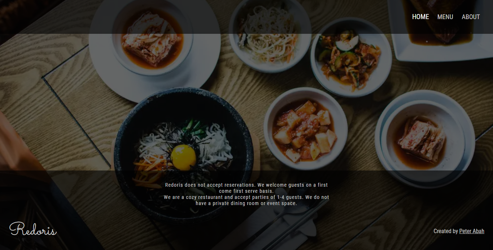
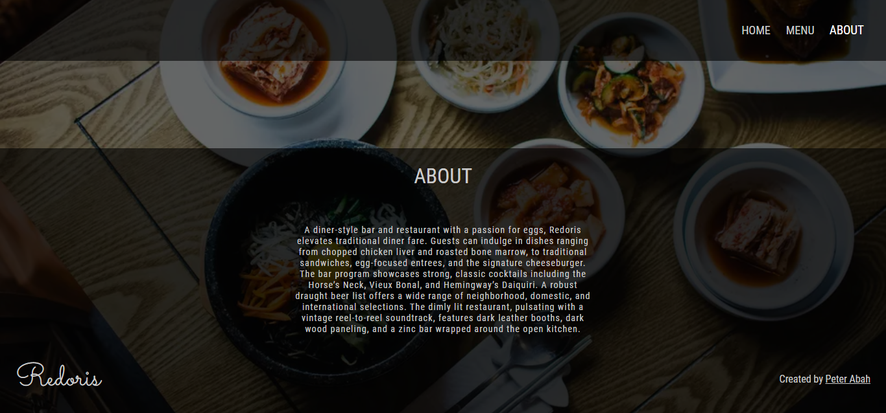
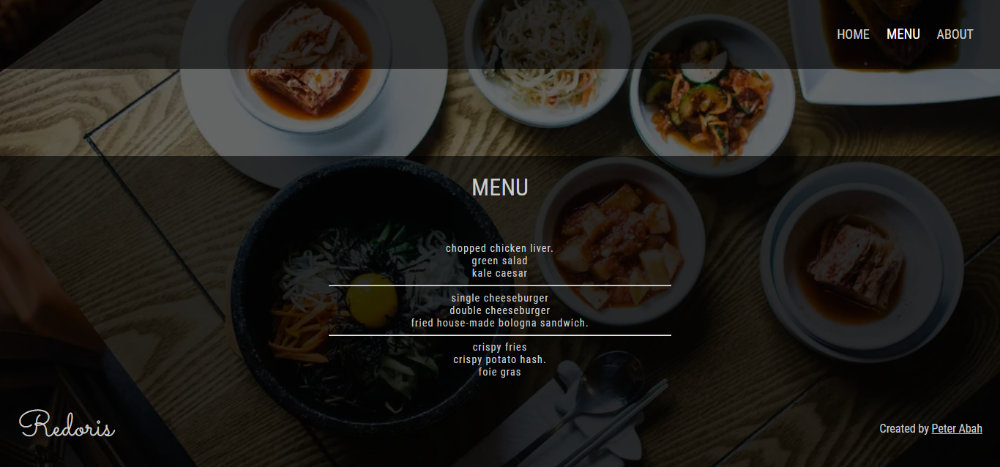

# Redoris Resataurant Page
This is a simple website for Redoris resataurant (fictional). The project is part of [The Odin Project's](https://www.theodinproject.com/paths/full-stack-ruby-on-rails/courses/javascript/lessons/restaurant-page) curriculum.

[LIVE PREVIEW](https://peter-abah.github.io/redoris-restaurant)

## Screenshot
### Home

### About

### Menu

## Built With
- HTML
- CSS
- SCSS
- JS
- Webpack

## What I learnt
The purpose of the project was to learn how to setup webpack in a project and how to use ES6 modules.
I also implemented tab navigation for the different sections

## Useful Resources
- [Guides | webpack](https://webpack.js.org/guides/)

## Acknowledgements
- [The Odin Project](https://theodinproject.com)
- Design inspired by [Au Cheval website](http://auchevaldiner.com/chicago/)
- Background image from [Unplash](https://unsplash.com) by [
Jakub Kapusnak](https://unsplash.com/@foodiesfeed).